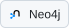
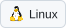

### Hi, I'm Lukash 👋

I hold a **Bachelor's degree in Computer Science** and am currently pursuing a **Master's degree in Data Science**.

My focus is **AI, software engineering and system automation**. I'm also developing my skills in data science, system architecture and design.

  <b>Languages</b> 
  <picture><source media="(prefers-color-scheme: dark)" srcset="assets/tech/python-dark.svg"></picture>
  <picture><source media="(prefers-color-scheme: dark)" srcset="assets/tech/cplusplus-dark.svg"></picture>
  <picture><source media="(prefers-color-scheme: dark)" srcset="assets/tech/c-dark.svg"></picture>
  <picture><source media="(prefers-color-scheme: dark)" srcset="assets/tech/java-dark.svg"></picture>
  <picture><source media="(prefers-color-scheme: dark)" srcset="assets/tech/haskell-dark.svg"></picture>
  <picture><source media="(prefers-color-scheme: dark)" srcset="assets/tech/prolog-dark.svg"></picture>

  <b>AI &amp; data science</b> 
  <picture><source media="(prefers-color-scheme: dark)" srcset="assets/tech/pytorch-dark.svg"></picture>
  <picture><source media="(prefers-color-scheme: dark)" srcset="assets/tech/huggingface-dark.svg"></picture>
  <picture><source media="(prefers-color-scheme: dark)" srcset="assets/tech/numpy-dark.svg"></picture>
  <picture><source media="(prefers-color-scheme: dark)" srcset="assets/tech/ollama-dark.svg"></picture>

  <b>Backend &amp; databases</b> 
  <picture><source media="(prefers-color-scheme: dark)" srcset="assets/tech/flask-dark.svg"></picture>
  <picture><source media="(prefers-color-scheme: dark)" srcset="assets/tech/fastapi-dark.svg"></picture>
  <picture><source media="(prefers-color-scheme: dark)" srcset="assets/tech/mongodb-dark.svg"></picture>
  <picture><source media="(prefers-color-scheme: dark)" srcset="assets/tech/redis-dark.svg"></picture>
  <picture><source media="(prefers-color-scheme: dark)" srcset="assets/tech/neo4j-dark.svg"></picture>

  <b>Tools</b> 
  <picture><source media="(prefers-color-scheme: dark)" srcset="assets/tech/linux-dark.svg"></picture>
  <picture><source media="(prefers-color-scheme: dark)" srcset="assets/tech/docker-dark.svg"></picture>
  <picture><source media="(prefers-color-scheme: dark)" srcset="assets/tech/git-dark.svg"></picture>

  <a href="mailto:lukashcode@gmail.com"><picture><source media="(prefers-color-scheme: dark)" srcset="assets/contact-email-dark.svg"></picture></a>
  <a href="https://liriti.com"><picture><source media="(prefers-color-scheme: dark)" srcset="assets/contact-website-dark.svg"></picture></a>
  <a href="https://www.linkedin.com/in/lukashm/"><picture><source media="(prefers-color-scheme: dark)" srcset="assets/contact-linkedin-dark.svg"></picture></a>

